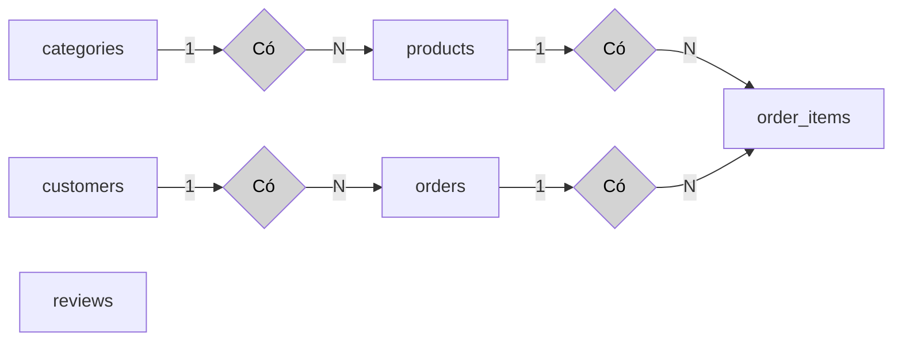
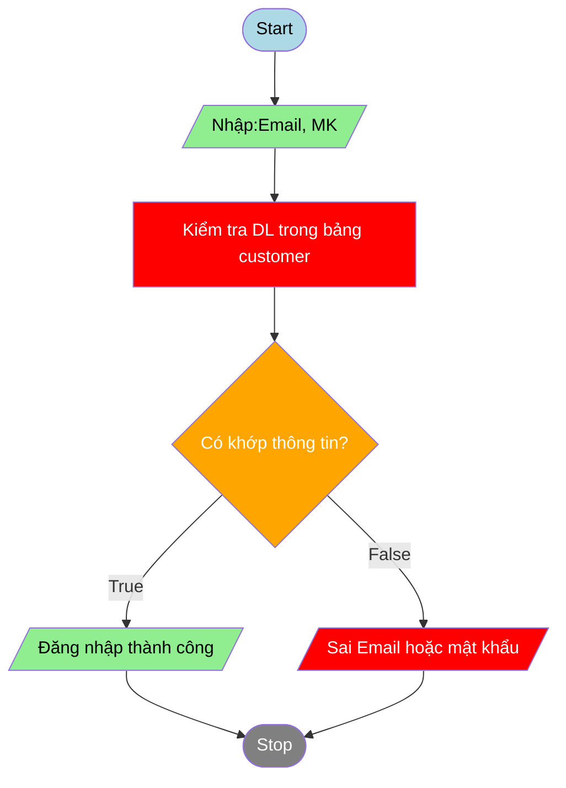

## Website bán hàng hoa quả online
Dưới đây là phần giới thiệu ngắn gọn, phân tích chức năng chi tiết và demo cơ sở dữ liệu (CSDL) cho **trang web bán hàng hoa quả online**:

---
### 🌐 **1. Giới thiệu ngắn gọn về đề tài**

Trang web bán hàng hoa quả online là một hệ thống thương mại điện tử giúp người tiêu dùng dễ dàng mua các loại hoa quả tươi sạch, an toàn thông qua mạng Internet. Khách hàng có thể duyệt sản phẩm, thêm vào giỏ hàng, thanh toán trực tuyến và nhận hàng tại nhà. Hệ thống cũng cho phép quản trị viên quản lý sản phẩm, đơn hàng và khách hàng một cách hiệu quả.

---

### ⚙️ **2. Phân tích chức năng cụ thể**

#### 🧑‍💼 **Đối tượng sử dụng hệ thống:**

* **Khách hàng (User):** Người mua hàng.
* **Quản trị viên (Admin):** Người quản lý hệ thống, sản phẩm, đơn hàng.

#### 📋 **Chức năng cho Khách hàng:**

1. **Đăng ký / Đăng nhập / Quên mật khẩu**
2. **Xem danh sách sản phẩm (hoa quả)**
3. **Tìm kiếm, lọc sản phẩm theo loại (cam, táo, dưa hấu,...)**
4. **Xem chi tiết sản phẩm**
5. **Thêm sản phẩm vào giỏ hàng**
6. **Cập nhật / xóa sản phẩm trong giỏ hàng**
7. **Đặt hàng và thanh toán**
8. **Xem lịch sử và trạng thái đơn hàng**
9. **Đánh giá sản phẩm, viết bình luận**
10. **Cập nhật thông tin cá nhân**

#### 🛠️ **Chức năng cho Quản trị viên:**

1. **Đăng nhập quản trị**
2. **Quản lý danh mục sản phẩm** (thêm, sửa, xóa loại hoa quả)
3. **Quản lý sản phẩm** (thêm, sửa, xóa sản phẩm)
4. **Quản lý đơn hàng** (xem chi tiết, cập nhật trạng thái giao hàng)
5. **Quản lý người dùng** (khóa / mở tài khoản)
6. **Thống kê doanh thu, số đơn hàng, sản phẩm bán chạy**
7. **Quản lý đánh giá và phản hồi khách hàng**

---

### 🗃️ **3. Demo Cơ sở dữ liệu (CSDL)**

Giả sử dùng MongoDB hoặc MySQL, dưới đây là **demo sơ đồ quan hệ CSDL** (dạng bảng nếu dùng SQL):

#### Bảng `users` (Người dùng)

| id | name | email | password | role (user/admin) | created\_at |
| -- | ---- | ----- | -------- | ----------------- | ----------- |

#### Bảng `categories` (Danh mục hoa quả)

\| id | name | description | created\_at |

#### Bảng `products` (Sản phẩm)

\| id | name | category\_id | price | image\_url | stock | description | created\_at |

#### Bảng `orders` (Đơn hàng)

\| id | user\_id | total\_amount | status | order\_date | delivery\_date |

#### Bảng `order_items` (Chi tiết đơn hàng)

\| id | order\_id | product\_id | quantity | price |

#### Bảng `reviews` (Đánh giá)

\| id | user\_id | product\_id | rating (1-5) | comment | created\_at |

---

### Sơ đồ quan hệ thực thể




### Sơ đồ flowchart login function


```html
<!DOCTYPE html>
<html lang="en">
<head>
    <meta charset="UTF-8">
    <meta name="viewport" content="width=device-width, initial-scale=1.0">
    <title>Document</title>
</head>
<body>
    
</body>
</html>
```

Dưới đây là **mã SQL** tạo bảng cho hệ thống **bán hàng hoa quả online**, sử dụng **MySQL** hoặc các hệ quản trị quan hệ khác (như PostgreSQL, SQL Server có thể dùng tương tự):

---

### ✅ **1. Bảng `users`**

```sql
CREATE TABLE users (
    id INT AUTO_INCREMENT PRIMARY KEY,
    name VARCHAR(100) NOT NULL,
    email VARCHAR(100) UNIQUE NOT NULL,
    password VARCHAR(255) NOT NULL,
    phone VARCHAR(20),
    address TEXT,
    role ENUM('user', 'admin') DEFAULT 'user',
    created_at DATETIME DEFAULT CURRENT_TIMESTAMP
);
```

---

### ✅ **2. Bảng `categories`**

```sql
CREATE TABLE categories (
    id INT AUTO_INCREMENT PRIMARY KEY,
    name VARCHAR(100) NOT NULL,
    description TEXT,
    created_at DATETIME DEFAULT CURRENT_TIMESTAMP
);
```

---

### ✅ **3. Bảng `products`**

```sql
CREATE TABLE products (
    id INT AUTO_INCREMENT PRIMARY KEY,
    name VARCHAR(100) NOT NULL,
    category_id INT,
    price DECIMAL(10,2) NOT NULL,
    image_url VARCHAR(255),
    stock INT DEFAULT 0,
    origin VARCHAR(100),
    description TEXT,
    created_at DATETIME DEFAULT CURRENT_TIMESTAMP,
    FOREIGN KEY (category_id) REFERENCES categories(id)
);
```

---

### ✅ **4. Bảng `carts`**

```sql
CREATE TABLE carts (
    id INT AUTO_INCREMENT PRIMARY KEY,
    user_id INT,
    created_at DATETIME DEFAULT CURRENT_TIMESTAMP,
    FOREIGN KEY (user_id) REFERENCES users(id)
);
```

---

### ✅ **5. Bảng `cart_items`**

```sql
CREATE TABLE cart_items (
    id INT AUTO_INCREMENT PRIMARY KEY,
    cart_id INT,
    product_id INT,
    quantity INT DEFAULT 1,
    FOREIGN KEY (cart_id) REFERENCES carts(id),
    FOREIGN KEY (product_id) REFERENCES products(id)
);
```

---

### ✅ **6. Bảng `orders`**

```sql
CREATE TABLE orders (
    id INT AUTO_INCREMENT PRIMARY KEY,
    user_id INT,
    total_amount DECIMAL(10,2),
    status ENUM('pending', 'shipped', 'delivered', 'canceled') DEFAULT 'pending',
    order_date DATETIME DEFAULT CURRENT_TIMESTAMP,
    delivery_date DATETIME,
    shipping_address TEXT,
    FOREIGN KEY (user_id) REFERENCES users(id)
);
```

---

### ✅ **7. Bảng `order_items`**

```sql
CREATE TABLE order_items (
    id INT AUTO_INCREMENT PRIMARY KEY,
    order_id INT,
    product_id INT,
    quantity INT,
    price DECIMAL(10,2),
    FOREIGN KEY (order_id) REFERENCES orders(id),
    FOREIGN KEY (product_id) REFERENCES products(id)
);
```

---

### ✅ **8. Bảng `reviews`**

```sql
CREATE TABLE reviews (
    id INT AUTO_INCREMENT PRIMARY KEY,
    user_id INT,
    product_id INT,
    rating INT CHECK (rating BETWEEN 1 AND 5),
    comment TEXT,
    created_at DATETIME DEFAULT CURRENT_TIMESTAMP,
    FOREIGN KEY (user_id) REFERENCES users(id),
    FOREIGN KEY (product_id) REFERENCES products(id)
);
```

---

### ✅ **9. Bảng `payments`** *(tuỳ chọn nếu tích hợp thanh toán)*

```sql
CREATE TABLE payments (
    id INT AUTO_INCREMENT PRIMARY KEY,
    order_id INT,
    payment_method VARCHAR(50), -- VNPay, Momo, COD
    payment_status ENUM('pending', 'completed', 'failed') DEFAULT 'pending',
    transaction_id VARCHAR(100),
    payment_date DATETIME DEFAULT CURRENT_TIMESTAMP,
    FOREIGN KEY (order_id) REFERENCES orders(id)
);
```

---

### ✅ **10. Bảng `feedbacks`**

```sql
CREATE TABLE feedbacks (
    id INT AUTO_INCREMENT PRIMARY KEY,
    name VARCHAR(100),
    email VARCHAR(100),
    message TEXT,
    created_at DATETIME DEFAULT CURRENT_TIMESTAMP
);
```
