## Website bán hàng hoa quả online
Dưới đây là phần giới thiệu ngắn gọn, phân tích chức năng chi tiết và demo cơ sở dữ liệu (CSDL) cho **trang web bán hàng hoa quả online**:

---
### 🌐 **1. Giới thiệu ngắn gọn về đề tài**

Trang web bán hàng hoa quả online là một hệ thống thương mại điện tử giúp người tiêu dùng dễ dàng mua các loại hoa quả tươi sạch, an toàn thông qua mạng Internet. Khách hàng có thể duyệt sản phẩm, thêm vào giỏ hàng, thanh toán trực tuyến và nhận hàng tại nhà. Hệ thống cũng cho phép quản trị viên quản lý sản phẩm, đơn hàng và khách hàng một cách hiệu quả.

---

### ⚙️ **2. Phân tích chức năng cụ thể**

#### 🧑‍💼 **Đối tượng sử dụng hệ thống:**

* **Khách hàng (User):** Người mua hàng.
* **Quản trị viên (Admin):** Người quản lý hệ thống, sản phẩm, đơn hàng.

#### 📋 **Chức năng cho Khách hàng:**

1. **Đăng ký / Đăng nhập / Quên mật khẩu**
2. **Xem danh sách sản phẩm (hoa quả)**
3. **Tìm kiếm, lọc sản phẩm theo loại (cam, táo, dưa hấu,...)**
4. **Xem chi tiết sản phẩm**
5. **Thêm sản phẩm vào giỏ hàng**
6. **Cập nhật / xóa sản phẩm trong giỏ hàng**
7. **Đặt hàng và thanh toán**
8. **Xem lịch sử và trạng thái đơn hàng**
9. **Đánh giá sản phẩm, viết bình luận**
10. **Cập nhật thông tin cá nhân**

#### 🛠️ **Chức năng cho Quản trị viên:**

1. **Đăng nhập quản trị**
2. **Quản lý danh mục sản phẩm** (thêm, sửa, xóa loại hoa quả)
3. **Quản lý sản phẩm** (thêm, sửa, xóa sản phẩm)
4. **Quản lý đơn hàng** (xem chi tiết, cập nhật trạng thái giao hàng)
5. **Quản lý người dùng** (khóa / mở tài khoản)
6. **Thống kê doanh thu, số đơn hàng, sản phẩm bán chạy**
7. **Quản lý đánh giá và phản hồi khách hàng**

---

### 🗃️ **3. Demo Cơ sở dữ liệu (CSDL)**

Giả sử dùng MongoDB hoặc MySQL, dưới đây là **demo sơ đồ quan hệ CSDL** (dạng bảng nếu dùng SQL):

#### Bảng `users` (Người dùng)

| id | name | email | password | role (user/admin) | created\_at |
| -- | ---- | ----- | -------- | ----------------- | ----------- |

#### Bảng `categories` (Danh mục hoa quả)

\| id | name | description | created\_at |

#### Bảng `products` (Sản phẩm)

\| id | name | category\_id | price | image\_url | stock | description | created\_at |

#### Bảng `orders` (Đơn hàng)

\| id | user\_id | total\_amount | status | order\_date | delivery\_date |

#### Bảng `order_items` (Chi tiết đơn hàng)

\| id | order\_id | product\_id | quantity | price |

#### Bảng `reviews` (Đánh giá)

\| id | user\_id | product\_id | rating (1-5) | comment | created\_at |

---

### Sơ đồ quan hệ thực thể

```mermaid
graph LR
    C[categories] --1 -->A{Có} -- N --> P[products]
    CUS[customers]  --1 -->B{Có} -- N --> O[orders]

    P[products]  --1 -->D{Có} -- N --> OT[order_items]
    OT[order_items]
    O[orders]  --1 -->E{Có} -- N --> OT[order_items]
    OT[order_items]
    R[reviews]

    style A fill:lightgray,color:#000
    style B fill:lightgray,color:#000
    style D fill:lightgray,color:#000
    style E fill:lightgray,color:#000
```




### Sơ đồ flowchart login function

```mermaid
flowchart TD
  A([Start]) --> B[/Nhập:Email, MK/]
--> C[Kiểm tra DL trong bảng customer]
--> D{Có khớp thông tin?}
-- True --> E[/Đăng nhập thành công/] --> X([Stop])
D{Có khớp thông tin?} -- False --> F[/Sai Email hoặc mật khẩu/] --> X([Stop])

style A fill:lightblue,color:#000
style B fill:lightgreen,color:#000
style C fill:red,color:#fff
style D fill:orange,color:#fff
style E fill:lightgreen,color:#000
style F fill:red,color:#fff
style X fill:gray,color:#fff
```


```html
<!DOCTYPE html>
<html lang="en">
<head>
    <meta charset="UTF-8">
    <meta name="viewport" content="width=device-width, initial-scale=1.0">
    <title>Document</title>
</head>
<body>
    
</body>
</html>
```


```sql
CREATE TABLE users (
    id INT AUTO_INCREMENT PRIMARY KEY,
    name VARCHAR(100) NOT NULL,
    email VARCHAR(100) UNIQUE NOT NULL,
    password VARCHAR(255) NOT NULL,
    phone VARCHAR(20),
    address TEXT,
    role ENUM('user', 'admin') DEFAULT 'user',
    created_at DATETIME DEFAULT CURRENT_TIMESTAMP
);

```